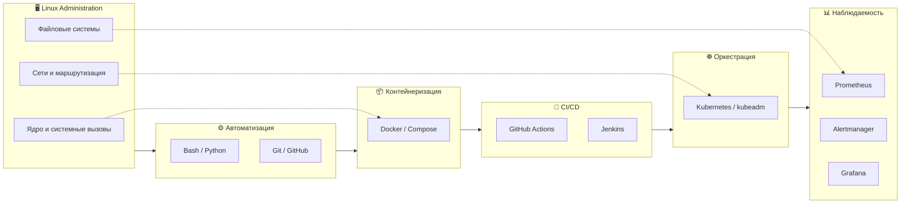

# 👋 Здравствуйте! Я Егор

### 🧑‍💻 Системный администратор → Linux Engineer / Junior DevOps

Занимаюсь администрированием Linux/Windows-инфраструктуры, автоматизацией на Bash и сопровождением корпоративных сервисов.
Развиваюсь в направлении Linux Engineering и DevOps: контейнеризация, CI/CD, GitHub Actions, Jenkins, Kubernetes и мониторинг.

📄 **Резюме:** [hh](https://hh.ru/resume/3035d41cff10607a400039ed1f32467a416956)

---

## 🎯 Ищу

Позицию **Junior DevOps / Linux Engineer**, где смогу применять:

- Linux-администрирование и автоматизацию (Bash, Ansible)
- Контейнеризацию и CI/CD (Docker, GitHub Actions, Jenkins)
- Мониторинг (Prometheus, Grafana, Alertmanager)
- Kubernetes (базовый уровень)

Формат: удалённо или гибрид. Готов к обучению и быстрому росту.

---

# 🧰 Технический стек

## 🖥️ ОС и администрирование

`Linux Administration` · `systemd` · `cron` · `package management`

---

## 🌐 Сети и инфраструктура

`TCP/IP` · `DNS` · `DHCP` · `AD` · `SSSD` · `Kerberos` · `SMB/CIFS` · `Nginx`

---

## 🐚 Скриптинг и автоматизация

`Bash` · `Python` · `sed` · `grep` · `awk` · `cron` · `systemd`

Автоматизирую установку и настройку ПО, конфигурацию рабочих станций, обслуживание сервисов и рутинные административные операции.

---

## 🐳 DevOps и CI/CD

`Dockerfile` · `Docker Compose` · `CI/CD` · `GitHub Actions` · `Jenkins` · `Pipeline` · `GHCR` · `kubeadm` · `kubectl` · `CNI`

> ℹ️ Kubernetes и CI/CD — практический опыт в pet-проектах.

---

## 📊 Мониторинг и информационная безопасность

`Prometheus` · `PromQL` · `Grafana` · `Alertmanager` · `Node Exporter` · `Zabbix Agent` · `UserParameter` · `OVAL` · `ScanOval` · `ФСТЭК`

---

## 🗄️ Базы данных

`PostgreSQL` · `Redis` · `SQL` · `pg_dump` · `Backup / Restore`

---

## 💻 Виртуализация

---

## 🌐 Web

> Базовый / Junior уровень.

---

## 🔧 Дополнительные инструменты

---

# 🗺️ Карта технологий

---

# 🧠 Навыки

| Направление | Статус |
|-------------|--------|
| Linux Administration | ✅ Освоено |
| Git / GitHub | ✅ Освоено |
| Docker / Docker Compose | ✅ Освоено |
| Bash-скрипты | ✅ Освоено |
| CI/CD: GitHub Actions, Jenkins | 🔄 Активно применяю |
| Monitoring: Prometheus, Grafana, Alertmanager | 🔄 Активно применяю |
| Kubernetes | 🔄 В работе |
| IaC: Ansible, Terraform | ⬜ В планах |
| Cloud: Yandex, VK, AWS | ⬜ В планах |
| DevSecOps | ⬜ В планах |
| Databases: PostgreSQL, Redis | 🔄 В работе |
| Web & Networking | 🔄 В работе |

> Все проекты в портфолио — практические, выполненные самостоятельно.

---

# 🚀 Избранные проекты и кейсы

## 🏢 Enterprise Automation & Security

**Bash · Zabbix · OVAL · SSSD/Kerberos · ФСТЭК**

*Коммерческий проект — Законодательное Собрание Кировской области*

### Проблема
Ручная подготовка рабочих мест занимала 2–3 часа. Требовалась автоматизация установки ПО, мониторинга, аудита безопасности и доступа к SMB-ресурсам.

### Решение
- Разработал Bash-скрипт автоматизированного развертывания ALT Linux.
- Автоматизировал установку ПО, настройку Zabbix Agent, GLPI, UrBackup и OVAL-сканирования.
- Реализовал `UserParameter` в Zabbix для передачи метрик OVAL.
- Настроил интеграцию Linux с Active Directory через SSSD/Kerberos.
- Автоматизировал подключение SMB-ресурсов.

### Результат
**Время подготовки рабочего места сокращено с 2–3 часов до 20–30 минут.**

---

## 🛠️ Immich Infrastructure Rescue

**Linux · Docker/Snap · PostgreSQL · Bash**

### Проблема
Сервис падал из-за OOM Killer, переполнения корневого раздела и проблем со схемой PostgreSQL после обновлений.

### Решение
- Перенёс данные PostgreSQL и медиабиблиотеку на отдельный раздел.
- Перенёс **390 ГБ** фотобиблиотеки без изменения путей в БД.
- Устранил PostgreSQL `schema drift` и восстановил первичные ключи.
- Добавил **4 ГБ swap** и снизил параллелизм ресурсоёмких задач.
- Настроил автоматическое резервное копирование PostgreSQL и очистку логов.

### Результат
Заполнение корневого раздела снижено **с 88% до 21%**, сервис стабилизирован.

---

## 🐳 Docker & Docker Compose

**Docker · Dockerfile · Multi-stage Build · Compose · Volumes · Networks · Healthcheck**

*Практическое применение контейнеризации в pet-проектах и производственных сценариях*

### Навыки
- Написание `Dockerfile` (включая **multi-stage build** для уменьшения размера образа).
- Работа с **Docker Compose**: описание многоконтейнерных приложений, настройка сетей, томов, переменных окружения.
- Настройка **healthcheck** для контроля доступности сервисов.
- Ограничение ресурсов: `--memory`, `--cpus`, `--pids-limit`.
- Управление томами: создание, бэкап, восстановление.
- Работа с сетями: `bridge`, `host`, `none`, пользовательские сети, service discovery.
- Безопасность контейнеров: запуск от не-root, `cap_drop`, `read_only`, сканирование **Trivy**, подпись **Cosign**.
- Интеграция Docker с **CI/CD** и публикация образов в **GHCR**.

> Навыки подтверждены в pet-проектах и задачах по спасению сервисов (Immich).

---

## 🔧 Git: управление версиями и практическое применение

**Git · GitHub · Branching · Merge/Rebase · Workflow**

*Система контроля версий, используемая во всех проектах*

### Навыки
- Инициализация репозиториев, коммиты, работа с историей.
- Ветвление, разрешение конфликтов, `rebase`, `cherry-pick`.
- Настройка SSH-аутентификации для GitHub.
- Ведение `README.md`, `WORKLOG.md` и документации.
- Отработка командной разработки через Pull Request.

> Навыки Git подтверждены во всех pet-проектах и коммерческой автоматизации.

---

## 🐍 [myflask](https://github.com/hagegata/myflask)

*Pet-проект: контейнеризация Flask-приложения и настройка CI/CD*

### Реализовано
- Разработан `Dockerfile` для Python-приложения (multi-stage build).
- Настроен `docker-compose.yml` для нескольких сервисов.
- Подключён Redis, настроены healthcheck.
- CI/CD pipeline в GitHub Actions:
  - Matrix-тестирование (Python 3.10, 3.11, 3.12).
  - Кэширование pip-зависимостей.
  - Сканирование образа через **Trivy**.
  - Подпись образа через **Cosign**.
  - Публикация в **GHCR** (только на main).

🔗 **Repository:** [github.com/hagegata/myflask](https://github.com/hagegata/myflask)

---

## ⚙️ [jenkins-lab](https://github.com/hagegata/jenkins-lab)

*Pet-проект: Jenkins Pipeline с Docker-in-Docker*

### Реализовано
- Jenkins LTS в Docker с кастомным `Dockerfile`.
- Установка **Docker CLI** внутрь контейнера Jenkins.
- Проброс `docker.sock` с правильным GID (425) для доступа без `chmod 666`.
- Pipeline из 4 стадий:
  - **Checkout** — скачивание кода из GitHub.
  - **Build** — сборка Docker-образа.
  - **Test** — проверка импорта Flask.
  - **Cleanup** — удаление образа.

🔗 **Repository:** [github.com/hagegata/jenkins-lab](https://github.com/hagegata/jenkins-lab)

---

## 📊 [monitoring](https://github.com/hagegata/monitoring)

*Pet-проект: стек наблюдаемости Prometheus + Grafana + Alertmanager*

### Реализовано
- Развёрнут **Prometheus** для сбора метрик.
- Настроен **Node Exporter** для метрик ОС (CPU, память, диск).
- Подключён **Grafana** как источник визуализации.
- Настроен **Alertmanager** — принимает алерты от Prometheus и маршрутизирует их получателям (webhook, email, Telegram). Правило `NodeDown` срабатывает, если таргет недоступен более 1 минуты.
- Полный цикл проверен: остановка Node Exporter → Firing → возврат → Inactive.
- Создан дашборд **Node Metrics** с панелями:
  - CPU Usage (`rate()` + фильтр по `mode="idle"`)
  - Memory Usage
  - Disk Usage (root)
  - Load Average
- Все сервисы работают в `network_mode: host` (обход проблемы с портами на ALT Linux).

🔗 **Repository:** [github.com/hagegata/monitoring](https://github.com/hagegata/monitoring)

---

## ☸️ [k8s-basics](https://github.com/hagegata/k8s-basics)

*Hands-on проект: развёртывание K8s-кластера с нуля*

### Реализовано
- Развёрнут одновузловой Kubernetes-кластер на ALT Linux.
- Настроены `kubeadm` и `containerd`.
- Созданы манифесты: `Pod`, `Deployment`, `Service`, `ConfigMap`, `Secret`, `StatefulSet`, `PV/PVC`.
- Выполнялась диагностика через `kubectl`.
- Исследовалась работа CNI-плагинов **Calico** и **Flannel**.
- Разбирались проблемы сетевого взаимодействия и запуска Pod.

> ℹ️ **Статус:** учебный стенд. Работаю над запуском CNI и деплоем приложений через Helm.

🔗 **Repository:** [github.com/hagegata/k8s-basics](https://github.com/hagegata/k8s-basics)

---

## 🛠️ [linux-automation](https://github.com/hagegata/linux-automation)

*Коллекция скриптов для автоматизации задач системного администрирования на рабочих станциях ALT Linux*

### Содержит:
- **autoinstall** — автоматизация развертывания рабочих станций (установка ПО, настройка Zabbix, OVAL-сканирование).
- **cifs-mount** — автоматическое монтирование SMB/CIFS-шар с Kerberos-аутентификацией, создание русскоязычных симлинков и закладок в Caja.
- **k8s-install** — установка Kubernetes и траблшутинг (Flannel, TLS, порты и др.).
- **ad-fix** — диагностика и исправление интеграции с Active Directory (SSSD/Winbind, id_max, кэш).

🔗 **Repository:** [github.com/hagegata/linux-automation](https://github.com/hagegata/linux-automation)
