# Егор Кузнецов

### Linux Engineer / System Administrator / Junior DevOps

Системный администратор Linux с коммерческим опытом автоматизации рабочих мест, мониторинга, сопровождения Linux/Windows-инфраструктуры и интеграции Linux с Active Directory.

В работе использую Bash, Zabbix, SSSD/Kerberos, SMB/CIFS и Docker. Развиваюсь в сторону Linux Engineering и Junior DevOps: изучаю Kubernetes, Ansible, CI/CD, Prometheus и Grafana.

В репозиториях собраны **реальные рабочие кейсы** и **учебные лабораторные стенды**. Учебные проекты помечены явно и не выдаются за production-опыт.

📄 **Резюме:** [hh.ru](https://hh.ru/resume/3035d41cff10607a400039ed1f32467a416956)

---

## 🧰 Ключевые навыки

- **Linux:** ALT Linux, Ubuntu, Astra Linux
- **Автоматизация:** Bash, Python, Ansible (Jinja2, Vault)
- **Мониторинг:** Zabbix, UserParameter, OVAL/ScanOval, Prometheus, Grafana, Alertmanager
- **Интеграция с AD:** SSSD, Kerberos, SMB/CIFS
- **Контейнеры:** Docker, Docker Compose, containerd
- **CI/CD:** GitHub Actions, Jenkins
- **Базы данных:** PostgreSQL, Redis
- **Kubernetes:** kubeadm, kubectl, манифесты *(базовый уровень)*

---

## 💼 Коммерческий опыт

Реальные задачи из Законодательного Собрания Кировской области и Ростелекома.

### 🏢 Enterprise Automation & Security

**Задача:** сократить время подготовки рабочих мест ALT Linux и внедрить аудит по ФСТЭК.

**Решение:**
- Bash-скрипт автоматизированного развёртывания: установка ПО, Zabbix Agent, GLPI, UrBackup, OVAL-сканирование.
- Мониторинг в Zabbix 7.0: UserParameter, авторегистрация, OVAL-метрики, триггеры.
- Интеграция с Active Directory через SSSD/Kerberos, автомонтирование SMB.
- Диагностический Bash-инструмент для AD/SSSD.

**Результат:** время подготовки рабочего места сокращено **с 2–3 часов до 20–30 минут**.

> Исходный код не опубликован из-за ограничений конфиденциальности.
> Обезличенные примеры и подходы — в репозитории [linux-automation](https://github.com/hagegata/linux-automation).

---

### 🛠️ Immich Infrastructure Rescue

**Задача:** стабилизировать сервис Immich, который падал из-за OOM Killer, заполнения диска и schema drift PostgreSQL.

**Решение:**
- Перенос PostgreSQL и медиабиблиотеки на отдельный раздел.
- Перенос **390 ГБ** данных без изменения путей в БД.
- Устранение schema drift, восстановление первичных ключей.
- Добавление 4 ГБ swap, снижение параллелизма задач.
- Автоматизация резервного копирования PostgreSQL.

**Результат:** заполнение корневого раздела снижено **с 88% до 21%**, устранены причины падений и восстановлена работоспособность сервиса.

---

## 🧪 Лабораторные проекты

Учебные стенды — практика технологий, не production-опыт.

### 🐍 [myflask](https://github.com/hagegata/myflask) — Docker + CI/CD

Flask + Redis. Dockerfile с multi-stage build, Compose, healthcheck.
CI в GitHub Actions: matrix-тесты (Python 3.10–3.12), cache, Trivy, Cosign, публикация в GHCR.

---

### 📊 [monitoring](https://github.com/hagegata/monitoring) — стек наблюдаемости

Prometheus + Node Exporter + Grafana + Alertmanager. Правило `NodeDown`: проверен полный цикл правила `Inactive → Pending → Firing → Inactive` и отправка алерта в Alertmanager. Дашборд Node Metrics (CPU, память, диск, Load Average).

---

### ⚙️ [ansible-lab](https://github.com/hagegata/ansible-lab) — IaC на Ansible

Inventory, роли, Jinja2-шаблоны, handlers, Vault. Подтверждена идемпотентность: первый запуск изменяет состояние, повторный даёт `changed=0`.

---

### ⚙️ [jenkins-lab](https://github.com/hagegata/jenkins-lab) — Jenkins pipeline

Jenkins в Docker. Pipeline из 4 стадий: Checkout → Build → Test → Cleanup.
Docker-команды выполняются через **подключённый Docker socket хоста** (не полноценный Docker-in-Docker).

---

### ☸️ [k8s-basics](https://github.com/hagegata/k8s-basics) — учебный Kubernetes-стенд

Одноузловой кластер на ALT Linux (kubeadm + containerd). Манифесты Pod/Deployment/Service/ConfigMap/Secret/StatefulSet/PV-PVC. Диагностика CNI (Flannel, Calico).

---

### 🛠️ [linux-automation](https://github.com/hagegata/linux-automation) — Bash-скрипты

autoinstall, cifs-mount, k8s-install, ad-fix — с документацией и траблшутингом.

---

## 🗺️ Карта технологий

```mermaid
flowchart LR
    subgraph Linux["🖥️ Linux: процессы и службы"]
        direction TB
        Core[Системное администрирование]
        Net[Сети и маршрутизация]
        Fs[Файловые системы]
    end

    subgraph Automation["⚙️ Автоматизация"]
        direction TB
        Bash[Bash / Python]
        Ansible[Ansible / Jinja2]
        Git[Git / GitHub]
    end

    subgraph Containers["📦 Контейнеры"]
        direction TB
        Docker[Docker / Compose]
    end

    subgraph CICD["🔁 CI/CD"]
        direction TB
        GHA[GitHub Actions]
        Jenkins[Jenkins]
    end

    subgraph Observability["📊 Наблюдаемость"]
        direction TB
        Prom[Prometheus]
        Alert[Alertmanager]
        Graf[Grafana]
    end

    Linux --> Automation
    Automation --> Containers
    Containers --> CICD
    CICD --> Observability
```

---

## 🎓 Курсы

- Docker — Минцифры (2026)
- Linux — Минцифры (2026)
- Администрирование ALT Linux — SIBINFOCENTER (2025)

---

## 📚 Сейчас изучаю

- **Kubernetes:** Helm, Ingress, диагностика сетевого взаимодействия и CNI
- **Terraform:** IaC для облаков
- **DevSecOps:** безопасность контейнеров и CI/CD
- **Loki:** логи в стеке мониторинга

---

## 📬 Контакты

- GitHub: [github.com/hagegata](https://github.com/hagegata)
- Telegram: @Kuznetsov_E_R
- Email: fradik.kuznezov@mail.ru
- Резюме: [hh.ru](https://hh.ru/resume/3035d41cff10607a400039ed1f32467a416956)
